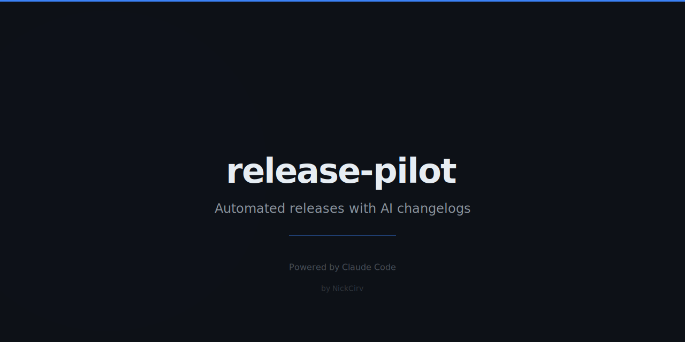

<p align="center"></p>

# release-pilot

Automated releases with AI-style changelogs from conventional commits.

## Install

```bash
npm install -g release-pilot
```

Or run without installing:

```bash
npx release-pilot
```

## Quick Demo

```bash
# Full release — bump, changelog, commit, tag, push
npx release-pilot release

# Preview what the next release would look like
npx release-pilot release --dry-run

# Force a major bump
npx release-pilot release --force major

# Preview changelog as JSON
npx release-pilot changelog --json

# Check repo is ready before releasing
npx release-pilot check
```

## Commands

### `release` (default)

Runs the full release flow: determines bump type from commits, updates `package.json`, generates `CHANGELOG.md`, creates a release commit, tags it, and pushes to origin.

```
Options:
  --dry-run          Preview all actions without writing any files or pushing
  --force <type>     Override bump type: major | minor | patch
  --no-push          Skip pushing the tag to remote
```

### `changelog`

Preview the changelog that would be generated for the next release — no files modified.

```
Options:
  --json             Output raw JSON (version, bumpType, commits, changelog text)
```

### `bump`

Bump the version in `package.json` only — no commit, no tag.

```
Options:
  --dry-run          Show the next version without writing package.json
  --force <type>     Override bump type: major | minor | patch
```

### `check`

Check whether the repo is ready for a release: clean working tree, on `main` or `master`, remote configured.

## Features

- Conventional commits — parses `feat:`, `fix:`, `chore:`, `perf:`, `refactor:`, `docs:`, `test:`, `ci:`, `build:`, `style:`, `revert:`
- Keep a Changelog format — output follows the [keepachangelog.com](https://keepachangelog.com/) spec
- Semver — automatic `major` / `minor` / `patch` bump based on commit types and breaking changes
- Breaking changes — detects `!` footer and `BREAKING CHANGE:` in commit bodies
- Dry-run mode — full preview of every action, zero side effects
- Annotated git tags — rich tag messages include the changelog excerpt
- Zero config — works out of the box in any git repo with a `package.json`

## Why

Most release tools are either too heavy (full CI pipelines) or too thin (just a version bump). release-pilot does exactly one job: read your commits, figure out what changed, and ship a well-formatted release — from a single command, locally, with no configuration files required.

## License

MIT — see [LICENSE](LICENSE)

## Author

[NickCirv](https://github.com/NickCirv)
