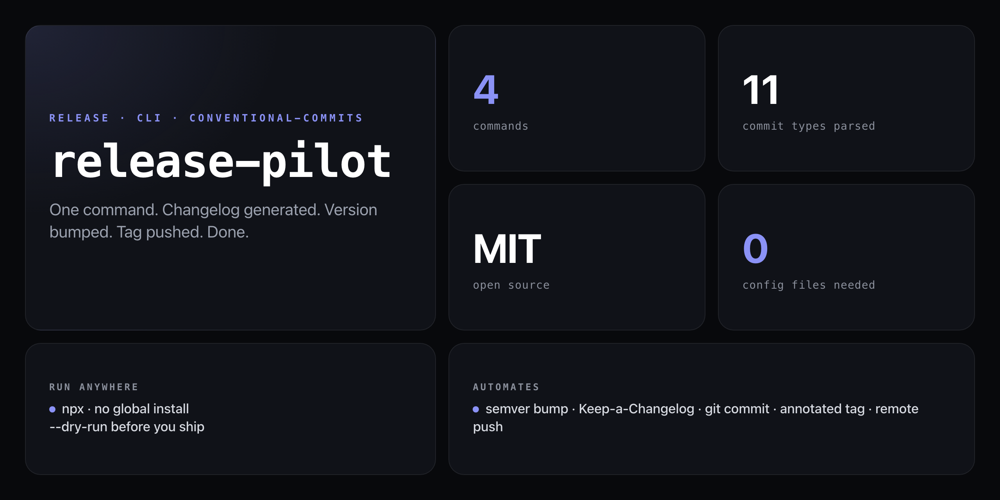

<div align="center">

**Turn conventional commits into a versioned release in one shot — no config, no CI required.**


</div>

---

You just merged 40 commits. Now you need a changelog, a version bump, a git tag, and somehow you need to remember what `fix: stuff` meant three weeks ago. `release-pilot` reads your conventional commits and does all of it in one command.

```
$ npx github:NickCirv/release-pilot release --dry-run

──────────────────────────────────────────────────
  release-pilot
──────────────────────────────────────────────────

  ┌─────────────────────────────────────┐
  │        DRY RUN — no changes made    │
  └─────────────────────────────────────┘

Version Bump

  1.2.3  →  1.3.0  (minor)

  · 12 commits analysed
  · 3 new feature(s)
  · 2 bug fix(es)

Changelog Preview

## [1.3.0] - 2026-02-27

### Added
  · feat: streaming support for large file exports
  · feat: configurable retry strategy on upload failures
  · feat: dark mode preference stored in localStorage

### Fixed
  · fix: memory leak when closing WebSocket connections
  · fix: incorrect date format in weekly summary headers

  → Would write 48 lines to CHANGELOG.md
  → Would commit: chore(release): v1.3.0

Git Tag

  ✔  Tag created: v1.3.0

──────────────────────────────────────────────────
  🚀  Release 1.3.0
──────────────────────────────────────────────────

  ✔  Changelog generated   (48 lines)
  ✔  package.json bumped   → 1.3.0
  ✔  Git commit created
  ✔  Tag created           v1.3.0
```

## Install

No global install, no config file — runs straight from GitHub:

```bash
npx github:NickCirv/release-pilot
```

## Usage

```bash
# full release flow (bump → changelog → commit → tag → push)
npx github:NickCirv/release-pilot release

# preview without touching anything
npx github:NickCirv/release-pilot release --dry-run

# force a specific bump type
npx github:NickCirv/release-pilot release --force minor

# preview the changelog only (no writes)
npx github:NickCirv/release-pilot changelog

# preview changelog as JSON
npx github:NickCirv/release-pilot changelog --json

# bump package.json only, no tag or commit
npx github:NickCirv/release-pilot bump

# check if the repo is ready (clean tree, remote configured)
npx github:NickCirv/release-pilot check
```

## Commands

| Command | What it does |
|---------|-------------|
| `release` | Full flow: bump → changelog → commit → annotated tag → push |
| `changelog` | Preview the changelog for the next release without touching files |
| `bump` | Bump `package.json` only — no commit, no tag |
| `check` | Verify clean working tree, correct branch, remote configured |

## Flags

| Flag | Commands | Description |
|------|----------|-------------|
| `--dry-run` | `release`, `bump` | Preview all actions, no files modified |
| `--force <type>` | `release`, `bump` | Override auto-detected bump: `major`, `minor`, or `patch` |
| `--no-push` | `release` | Create tag locally, skip the remote push |
| `--json` | `changelog` | Output raw JSON instead of formatted markdown |

## How it works

1. **Reads** your git log since the last tag (`git log v1.2.3..HEAD`)
2. **Parses** conventional commits — `feat:` bumps minor, `fix:` bumps patch, `BREAKING CHANGE:` bumps major
3. **Generates** a [Keep a Changelog](https://keepachangelog.com/) formatted `CHANGELOG.md`, prepended to any existing entries
4. **Bumps** `package.json`, commits `chore(release): vX.Y.Z`, creates an annotated git tag, and pushes

Conventional commit types recognised: `feat`, `fix`, `chore`, `perf`, `refactor`, `docs`, `test`, `ci`, `build`, `style`, `revert`

Breaking changes detected via `!` suffix (e.g. `feat!: drop Node 16`) or `BREAKING CHANGE:` in the commit body.

## Why not X?

> **semantic-release** needs a CI environment and a mountain of config.
> **standard-version** is unmaintained and archived.
> **release-it** needs a config file and interactive prompts.
>
> release-pilot needs nothing. `npx github:NickCirv/release-pilot` and go.

## What it is NOT

- **Not a CI/CD platform.** It runs locally or in any shell — it doesn't manage pipelines, secrets, or deployment targets.
- **Not a monorepo release tool.** It manages a single `package.json` version per run.
- **Not a semantic-release replacement at scale.** For complex multi-package workflows with plugin ecosystems, semantic-release remains the right tool.

---

<div align="center">
<sub>Node 18+ · MIT · by <a href="https://github.com/NickCirv">NickCirv</a></sub>
</div>
